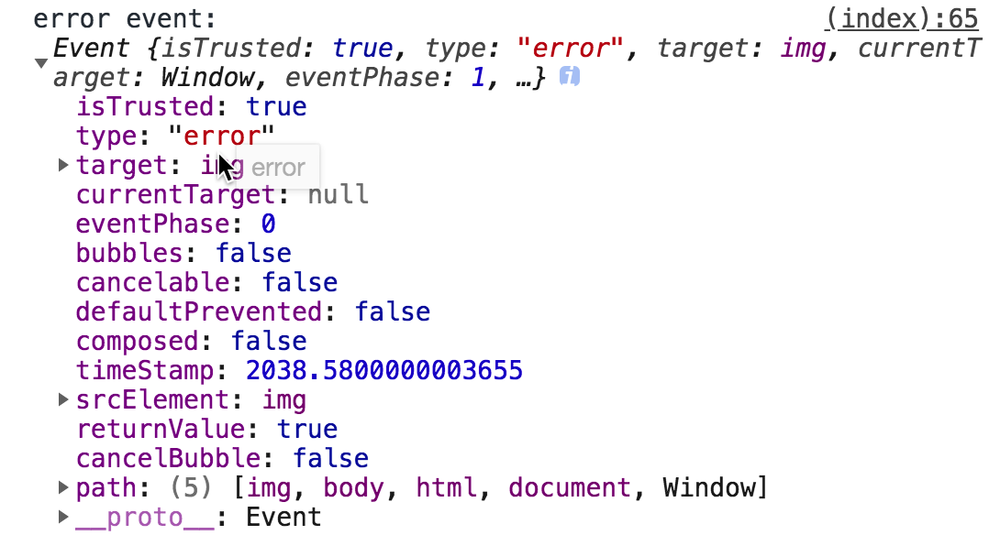

# 前端异常监控系统

## 您将Get的技能

- 收集前端错误（原生、React、Vue）
- 错误上报至后端服务器
- 解析错误堆栈
- 利用webpack插件自动上传sourcemap
- docker部署


## 工作流程

1. 收集错误
2. 上报错误
3. 代码上线打包将sourcemap文件上传至错误监控服务器
4. 发生错误时监控服务器接收错误并记录到日志中
5. 根据sourcemap和错误日志内容进行错误分析


## 收集异常

### JS异常处理

js异常的特点是,出现不会导致JS引擎崩溃 最多只会终止当前执行的任务。比如一个页面有两个按钮，如果点击按钮发生异常页面，这个时候页面不会崩溃，只是这个按钮的功能失效，其他按钮还会有效。


```js
setTimeout(() => {
  console.log('1->begin')
  error
  console.log('1->end')
})
setTimeout(() => {
  console.log('2->begin')
  console.log('2->end')
})
```


上面的例子我们用setTimeout分别启动了两个任务，虽然第一个任务执行了一个错误的方法。程序执行停止了。但是另外一个任务并没有收到影响。


其实如果你不打开控制台都看不到发生了错误。好像是错误是在静默中发生的。

下面我们来看看这样的错误该如何收集。

#### try-catch

JS作为一门高级语言我们首先想到的使用try-catch来收集。

```js
setTimeout(() => {
  try {
    console.log('1->begin')
    error
    console.log('1->end')
  } catch (e) {
    console.log('catch',e)
  }
})
```


如果在函数中错误没有被捕获，错误会上抛。

```js
function fun1() {
  console.log('1->begin')
  error
  console.log('1->end')
}
setTimeout(() => {
  try {
    fun1()
  } catch (e) {
    console.log('catch',e)
  }
})
```

控制台中打印出的分别是错误信息和错误堆栈。


读到这里大家可能会想那就在最底层做一个错误try-catch不就好了吗。确实作为一个从java转过来的程序员也是这么想的。但是理想很丰满，现实很骨感。我们看看下一个例子。

```js
function fun1() {
  console.log('1->begin')
  error
  console.log('1->end')
}

try {
  setTimeout(() => {
    fun1()

  })
} catch (e) {
  console.log('catch', e)
}
```


大家注意运行结果，异常并没有被捕获。

这是因为JS的try-catch功能非常有限一遇到异步就不好用了。那总不能为了收集错误给所有的异步都加一个try-catch吧，太坑爹了。其实你想想异步任务其实也不是由代码形式上的上层调用的就比如本例中的settimeout。大家想想eventloop就明白啦，其实这些一步函数都是就好比一群没娘的孩子出了错误找不到家大人。当然我也想过一些黑魔法来处理这个问题比如代理执行或者用过的异步方法。算了还是还是再看看吧。


### window.onerror

window.onerror 最大的好处就是可以同步任务还是异步任务都可捕获。

```js
function fun1() {
  console.log('1->begin')
  error
  console.log('1->end')
}
window.onerror = (...args) => {
  console.log('onerror:',args)
}

setTimeout(() => {
  fun1()
})
```


- onerror返回值

  onerror还有一个问题大家要注意 如果返回返回true 就不会被上抛了。不然控制台中还会看到错误日志。


### 监听错误事件

> window.addEventListener('error',() => {}）

其实onerror固然好但是还是有一类异常无法捕获。这就是网络异常的错误。比如下面的例子。

```html

```

试想一下我们如果页面上要显示的图片突然不显示了，而我们浑然不知那就是麻烦了。

addEventListener就是

```js
window.addEventListener('error', args => {
  console.log(
    'error event:', args
  );
  return true;
}, true);
```

运行结果如下：




### Promise错误的捕获

Promise的出现主要是为了让我们解决回调地域问题。基本是我们程序开发的标配了。虽然我们提倡使用es7 async/await语法来写，但是不排除很多祖传代码还是存在Promise写法。

```js
new Promise((resolve, reject) => {
  abcxxx()
});
```

这种情况无论是onerror还是监听错误事件都是无法捕获的

```js
new Promise((resolve, reject) => {
  error()
})
// 增加异常捕获
  .catch((err) => {
  console.log('promise catch:',err)
});
```

除非每个Promise都添加一个catch方法。但是显然是不能这样做。


### Vue

### React


## 错误上报


## 错误分析
### Webpack插件实现SourceMap上传

### 解析ErrorStack

### 还原代码